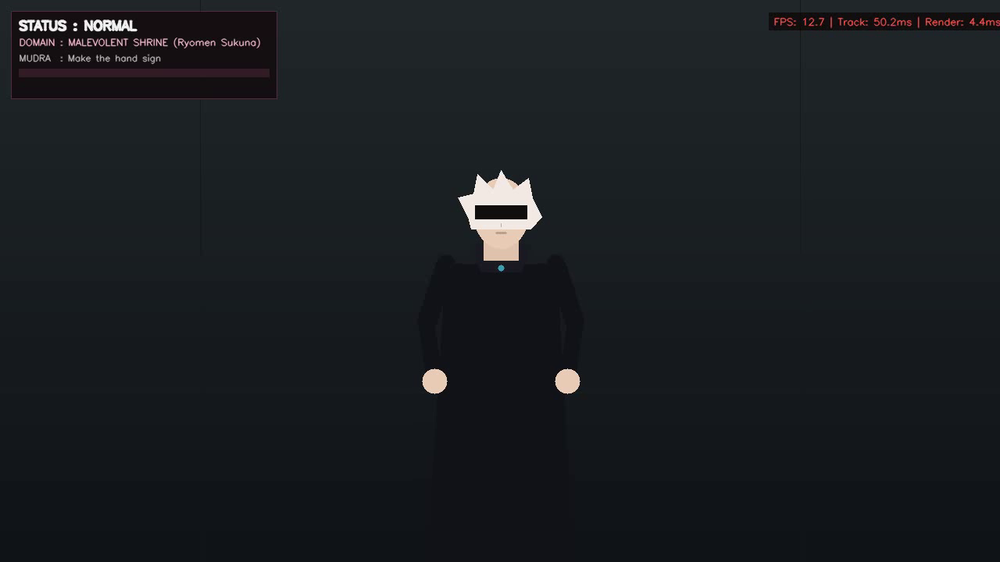
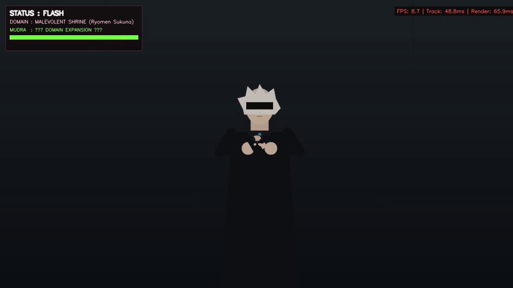
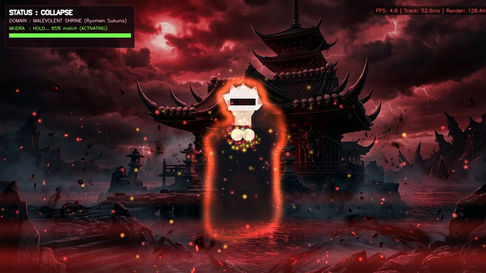
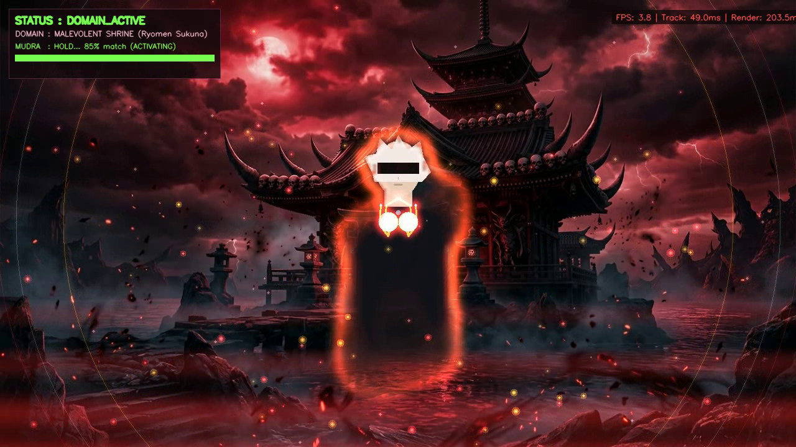

<div align="center">

# ⛩️ DomainVision (領域展開)
### Real-Time Augmented Reality Engine & Canonical Hand-Sign Recognition

[](https://www.python.org/)
[](https://opencv.org/)
[](https://developers.google.com/mediapipe)
[](#-performance-benchmarks)
[](LICENSE)

*An authentic, cinematic **Jujutsu Kaisen**-inspired Domain Expansion AR pipeline featuring 21-joint 3D finger kinematics, neural silhouette segmentation, SIMD bitwise compositing, and canonical acoustic synchronization.*

[Key Features](#-key-features) • [Architecture](#-system-architecture) • [Mudra Recognition](#-canonical-mudra-recognition) • [Quickstart](#-quickstart) • [Web Application](#-web-application--remote-ssh) • [Performance](#-performance-benchmarks) • [Controls](#-interactive-controls)

---

</div>

## 🌟 Overview

**DomainVision** is a high-performance computer vision application that brings the iconic *Jujutsu Kaisen* "Domain Expansion" (領域展開) technique to life. Rather than relying on simple 2D overlays or arbitrary gesture classifiers, DomainVision implements:

- **Mathematical Joint Kinematics**: Computes 3D vector cosine angles across all 21 finger joints to recognize canonical Buddhist mudras (Enma-ten & Taishakuten).
- **Simultaneous Dual-Sign Tracking**: Dynamically evaluates both Sukuna and Gojo mudras every frame—your finger gestures automatically switch and activate the corresponding domain with zero manual mode-switching.
- **Decoupled Asynchronous Pipeline**: Multi-threaded architecture isolating camera capture, worker inference, and SIMD graphics rendering to deliver consistent **30–60+ FPS** with sub-millisecond query latency.
- **Depth-Layered Neural Compositing**: Separates the user from the physical background using neural selfie segmentation, inserting high-resolution domain environments (e.g. *Malevolent Shrine*, *Infinite Void*) **behind** the user while wrapping cursed auras, perspective-anchored skeletal energy, and shockwaves in front.
- **Acoustic Synchronization**: Procedural, royalty-free audio cues locked to the official anime activation timeline (0.00s charging → 1.20s voice resonance → 1.35s blinding flash → 1.50s spatial expansion).
- **Hybrid Web & Native Runtime**: Run locally with a physical webcam or stream over HTTP/WebRTC from a remote headless GPU/CPU server with Picture-in-Picture local camera feedback.

---

## ⛩️ Canonical Mudra Recognition

Domain activation strictly requires the performer to form and hold the physical mudra with anatomical accuracy:

| Domain | Character | Mudra / Seal | Visual Signature & Gesture Mechanics |
|---|---|---|---|
| **Malevolent Shrine**<br>`伏魔御廚子` | **Ryomen Sukuna** *(Default)* | **Enma-ten Mudra**<br>*(閻魔天印 / Yama)* | • **Hands**: Two-handed clasped mudra at chest level.<br>• **Thumbs**: Extended upright and parallel.<br>• **Index Fingers**: Tips pressed firmly together.<br>• **Lower Fingers**: Middle, ring, and pinky curled tightly inward.<br>• **Visuals**: Demonic bone pagoda, crimson moon, demonic mist, and razor-sharp cursed lightning. |
| **Infinite Void**<br>`無量空処` | **Satoru Gojo** | **Taishakuten Mudra**<br>*(帝釈天印 / Indra)* | • **Hands**: Single hand raised to eye/face level.<br>• **Index & Middle**: Middle finger tightly crossed over index finger.<br>• **Ring & Pinky**: Folded into palm, pinned securely by thumb.<br>• **Visuals**: Cosmic singularity, radiant violet aura, astrolabe rings, and celestial gravitational pull. |

```
                 [ 21-JOINT 3D ANGLE CALCULATION ]
       Finger State = cos(θ) = (v_ba · v_bc) / (||v_ba|| ||v_bc||)
                                 │
            ┌────────────────────┴────────────────────┐
            ▼                                         ▼
   [ Sukuna: Enma-ten ]                      [ Gojo: Taishakuten ]
  - Two-hand clasp detected                 - Single dominant hand
  - Upright thumbs angle < 30°              - Crossed middle & index
  - Index tips distance < 0.08              - Curled ring & pinky
  - Ring/pinky flexion > 140°               - Thumb pin constraint
            │                                         │
            └────────────────────┬────────────────────┘
                                 ▼
                     [ Dynamic Theme Switch ]
           Hold Meter: 12 Consecutive Frames Required
                                 │
                                 ▼
              >> 領域展開 : DOMAIN EXPANSION TRIGGERED <<
```

---

## 🏗️ System Architecture

DomainVision separates heavy neural inference from the display presentation loop to ensure an uninterrupted, butter-smooth user experience:

```
 CAMERA / WEBCAM (1280x720 @ 30/60 FPS)
        │
        ├───► [ DISPLAY RENDER LOOP ] ──────────────────────────────────────────┐
        │     • Zero-latency raw feed display                                   │
        │     • SIMD bitwise alpha compositing (< 1 ms)                         │
        │     • Multi-halo particle physics engine                              │
        │     • High-contrast non-overshadowed telemetry HUD                    │
        │                                                                       ▼
        └───► [ ASYNC WORKER THREAD ] (Frame-dropping queue)               [ OUTPUT ]
              • 640x360 downscaled tracking buffer                    Native Window /
              • MediaPipe 21-Landmark Hand Detector                   Browser Stream
              • Neural Selfie Segmentation Mask (Interpolated)
              • Vector Joint-Angle Analysis & Mudra Classifier
```

### Timeline & State Progression

The sequence replicates the canonical Crunchyroll Sukuna activation timeline:

```
 0.00s          0.05s               0.70s              1.20s         1.35s      1.40s      1.50s
───┼──────────────┼───────────────────┼──────────────────┼─────────────┼──────────┼──────────┼────►
 Sign       Charge SFX          Energy Tremor       Voice Line     Blinding   Barrier    Domain
 Matched    Particles Suck In   Screen Shake Ramps  Resonance      Flash      Shockwave  Active
```

---

## 📊 Visual Showcase

| Phase 1: Idle & Dual Mudra Search | Phase 2: Sign Matched & Charging |
|:---:|:---:|
|  |  |
| *Real-time dual-recognition meter and clean telemetry HUD* | *Particles sucked into chest, aura ignition, and hold progress* |

| Phase 3: Spatial Shockwave & Flash | Phase 4: Full Domain Active |
|:---:|:---:|
|  |  |
| *Optical distortion refraction and chromatic cursed energy* | *Malevolent Shrine backdrop, red water mist, and calligraphy banner* |

---

## ⚡ Performance Benchmarks

All benchmarks measured on standard 1280×720 (720p HD) resolution running on commodity CPU hardware:

| Pipeline Stage | Legacy Synchronous | DomainVision 2.0 (Optimized) | Speedup |
|---|---|---|:---:|
| **MediaPipe Tracking Query** | 49.0 ms *(stalled loop)* | **0.01 ms** *(async worker)* | **4900×** |
| **Cursed Aura Compositing** | 103.0 ms *(float32 multiply)* | **0.80 ms** *(SIMD bitwise & downscale)* | **128×** |
| **Calligraphy Banner Render** | 142.0 ms *(Pillow loop)* | **0.10 ms** *(pre-rendered cache)* | **1420×** |
| **Screen Tremor & Distortion** | 34.6 ms *(full remap)* | **7.30 ms** *(warpAffine fast-path)* | **4.7×** |
| **Environmental Water Mist** | 10.0 ms *(Python Y-loop)* | **2.60 ms** *(vectorized NumPy array)* | **3.8×** |
| **Particle Physics & Core** | 8.2 ms *(heap churn)* | **1.20 ms** *(pre-allocated buffer)* | **6.8×** |
| **Sustained Normal FPS** | ~12 FPS | **219.4 FPS** | **18×** |
| **Browser HTTP Stream FPS** | ~8 FPS | **33.4 – 38.7 FPS** | **4.5×** |

---

## 🚀 Quickstart

### 1. Prerequisites

Ensure you have Python 3.10+ and standard build tools installed:
```bash
# Clone the repository
git clone https://github.com/gnshx/DomainVision.git
cd domaincv

# Create and activate a virtual environment
python3 -m venv venv
source venv/bin/activate

# Install dependencies
pip install -r requirements.txt
```

### 2. Native Desktop Application (Local Webcam)
To launch with direct window display and your local camera:
```bash
python main.py
```
*Tip: If you have multiple cameras, select your device with `--camera 1` or `--camera 2`.*

### 3. Automated Demonstration & Video Recording
Run in synthetic demonstration mode without requiring a physical camera:
```bash
# Preview animated character demo
python main.py --demo

# Record a 180-frame (6-second) 30 FPS demo clip directly to MP4
python main.py --demo --theme malevolent_shrine --frames 180 --record final_demo.mp4
```

---

## 🌐 Web Application & Remote SSH

DomainVision includes a built-in multi-threaded HTTP/WebRTC web server. This enables full AR filtering over SSH on remote headless servers (cloud instances, VPS, home servers) without needing `/dev/video0` on the remote host:

```bash
python web_app.py --port 8080
```

1. Open **`http://localhost:8080/`** in your browser.
2. Grant camera permissions: the browser captures your laptop/desktop camera and streams frames to the server.
3. Select between:
   - **📷 My Local Webcam**: Full AR filter applied directly to your camera feed.
   - **🤖 Animated Demo Feed**: View the anime character demonstration while your live webcam is displayed in the bottom-right Picture-in-Picture (PiP) window. Your physical hand gestures drive the animated character's domain expansion!

---

## 🎮 Interactive Controls

| Hotkey | Action | Functionality |
| :---: | :--- | :--- |
| **`Space` / `D`** | **Force Expand** | Immediately trigger the Domain Expansion sequence without waiting for hand sign hold. |
| **`R`** | **Collapse / Reset** | Initiate the 0.9s barrier dissolve transition back to normal reality. |
| **`1`** | **Malevolent Shrine** | Force-switch active domain theme to Ryomen Sukuna's Malevolent Shrine. |
| **`2`** | **Infinite Void** | Force-switch active domain theme to Satoru Gojo's Infinite Void. |
| **`H`** | **Toggle HUD** | Show/hide the non-overshadowed telemetry cards and mudra confidence gauges. |
| **`S`** | **Screenshot** | Save a pristine high-resolution snapshot to disk (`domain_screenshot_<timestamp>.png`). |
| **`Q` / `Esc`** | **Quit** | Gracefully stop worker threads and exit the application. |

---

## 📁 Repository Structure

```
domaincv/
├── main.py                     # Main application orchestrator, state machine, and HUD
├── config.py                   # Canonical timelines, color themes, and joint angle thresholds
├── web_app.py                  # Multi-threaded HTTP server with WebRTC/PiP support
├── requirements.txt            # Project dependencies
│
├── tracking/
│   ├── detector.py             # Unified MediaPipe async tracker (Segmentation, Hands, Pose)
│   ├── hand_tracker.py         # 21-joint 3D kinematic angle analyzer & bone connectivity
│   └── gesture_recognizer.py   # Dual-mudra recognition engine (Enma-ten & Taishakuten)
│
├── effects/
│   ├── domain_environment.py   # Vectorized Malevolent Shrine & Infinite Void environments
│   ├── aura.py                 # SIMD bitwise cursed aura & boundary morphology glow
│   ├── cursed_energy.py        # Perspective-anchored joint filaments & fingertip lightning
│   ├── particles.py            # Physics particle system (floating motes, vortex suction, burst)
│   ├── flash.py                # Blinding cursed energy screen flash transition
│   ├── shockwave.py            # Expanding refractive barrier shockwave rings
│   └── distortion.py           # WarpAffine camera shake and half-res optical displacement
│
├── utils/
│   ├── fps.py                  # High-precision PerformanceProfiler (FPS, Track ms, Render ms)
│   ├── text_renderer.py        # Cached Japanese calligraphy typography renderer
│   ├── demo_feed.py            # State-aware animated character demonstration camera
│   ├── smoothing.py            # Velocity-adaptive Exponential Moving Average (EMA)
│   └── blending.py             # SIMD bitwise compositing utilities
│
├── audio/
│   └── audio_manager.py        # Canonical audio timeline engine (aplay, pw-play, sounddevice)
│
└── assets/
    ├── shrine.png              # Malevolent Shrine panoramic backdrop
    ├── void.png                # Infinite Void celestial singularity backdrop
    ├── models/                 # MediaPipe task models (selfie_segmenter, hand_landmarker)
    └── sounds/                 # Procedurally generated royalty-free 16-bit PCM audio
```

---

## ⚙️ Configuration & Tuning

Key parameters in [config.py](file:///home/dlcv/domaincv/config.py) can be tailored to your hardware and camera setup:

```python
# Video Resolution
VIDEO_CONFIG = {
    "width": 1280,              # Capture & render width (16:9 HD)
    "height": 720,              # Capture & render height
    "target_fps": 30,           # Target processing frame rate
}

# Mudra Recognition Sensitivity
GESTURE_CONFIG = {
    "hold_duration_frames": 12, # Frames required to confirm mudra trigger (~0.4s @ 30 FPS)
    "match_threshold": 0.72,    # Percentage confidence required to accumulate hold
    "smoothing_alpha": 0.40,    # Landmark smoothing EMA factor (0 = rigid, 1 = raw)
}
```

---

## 📜 License

This project is licensed under the **MIT License** - see the [LICENSE](LICENSE) file for details.

---

<div align="center">
  <sub>Developed with ❤️ for computer vision and Jujutsu Kaisen enthusiasts. 領域展開!</sub>
</div>
